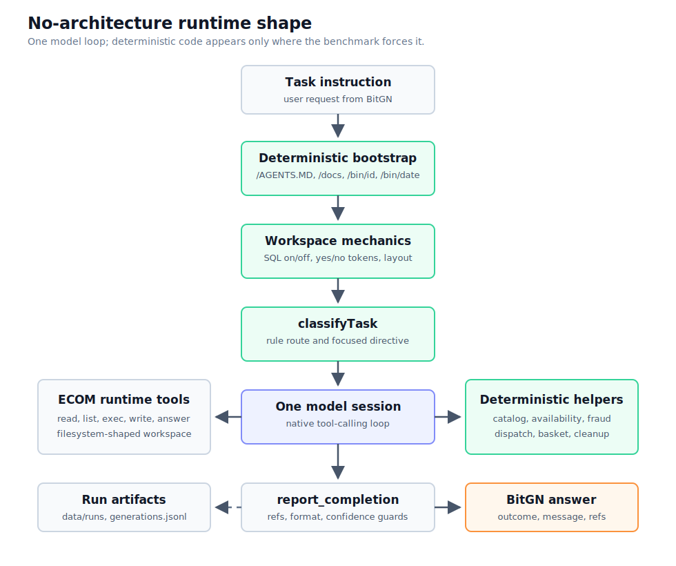
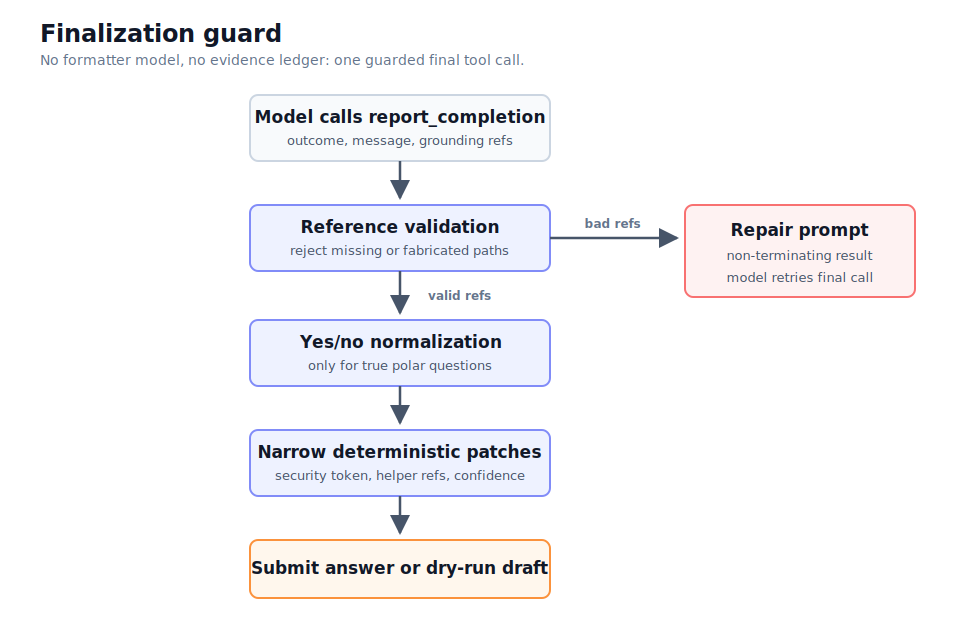
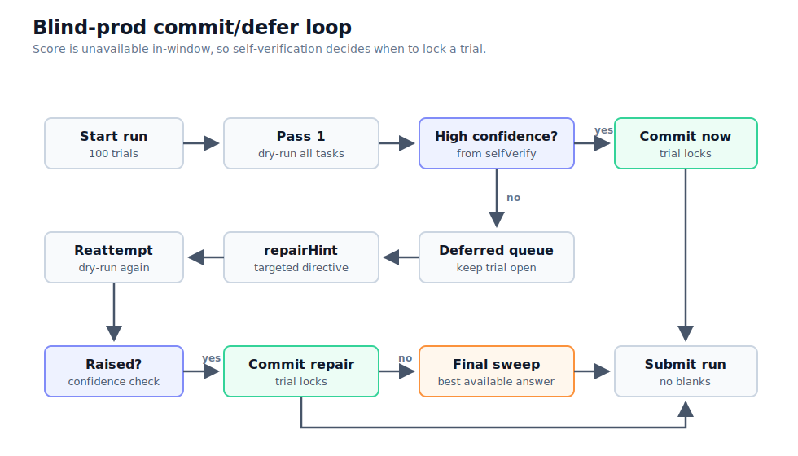

# No Architecture: a model-first ECOM1 agent with deterministic tools

_A counterpoint to [Exoskeleton: a lightweight model-dispatcher in a deterministic harness](https://github.com/vsavkov/bitgn-ecom1-exoskeleton/blob/main/articles/ARCHITECTURE.md)._

The spirit is Bitter Lesson-shaped: keep the harness small, let the model carry the messy judgment, and move only repeated, stable mechanics into code.

## The claim

The Exoskeleton article describes a deliberately layered agent:

- a small intent classifier at the edge;
- deterministic preflight checks;
- a main model dispatcher;
- domain helpers;
- an evidence ledger;
- reference normalization;
- a final formatter;
- telemetry outside the loop.

This model-first ECOM1 agent asks a deliberately constrained question: **how far can ECOM1 be pushed when the model carries the workflow and the harness stays small?**

"No architecture" does not mean "no engineering". It means there is no multi-model stack, no separate classifier model, no formatter model, no helper-model pipeline, and no hidden controller that decides the task before the main model sees it. The core is one native tool-calling loop. One model reads the workspace, chooses tools, performs the reasoning, and calls `report_completion`.

The engineering is concentrated in the tool surface and in narrow deterministic guards:

- typed ECOM filesystem tools;
- a large operating manual in the system prompt;
- task-aware tool routing;
- deterministic helper tools for repeatable failure classes;
- reference existence checks;
- exact yes/no token normalization;
- self-verification for blind runs;
- run recording and postmortems.

So the honest name is not "no architecture". It is **one model, one loop, and only the code the benchmark forces into existence**.

## Why ECOM1 still forces structure

ECOM1 is not graded like a chat answer. The final submission has multiple channels:

- `outcome`: the service result, such as OK, denied for security, clarification, unsupported, or internal error.
- `message`: the user-visible answer, often with an exact required format.
- `grounding_refs`: the exact policy and record paths that justify the answer.

That matters because a model can understand the business task and still score zero by:

- using the wrong outcome token;
- answering in prose when the task asked for a bare count or SKU;
- citing an explored-but-not-used record;
- omitting a required basket, product, payment, return, store, upload, or policy document;
- citing another customer's protected record on a denial;
- using SQL in a file-based production workspace where SQL is a trap.

The Exoskeleton design handles this by separating those concerns into layers. The model-first agent handles it by keeping the main loop intact and adding small, local pieces only where repeated evidence showed the model was unreliable.

## What actually runs

The implementation is centered in `src/agent.ts`.

Each task starts with a deterministic bootstrap:

- `tree /`;
- read `/AGENTS.MD` when present;
- read `/docs/README.md` when present;
- `tree /docs`;
- run `/bin/id`;
- run `/bin/date`.

The bootstrap is not a separate planning stage. Its results are inserted into the initial prompt as already-executed workspace context. Then the agent detects basic mechanics from the workspace's own docs:

- whether SQL is endorsed or should be disabled;
- whether `/proc` files are the source of truth;
- what yes/no tokens are required;
- what record layout appears to exist.

Then `classifyTask` performs a cheap in-process route selection. It is not an LLM classifier. It is string/rule based and conservative: base filesystem tools are always available, and the classifier only narrows the specialized tools plus appends a focused directive. If classification misses, the model still has the raw filesystem.

The model session is then created through the `pi` SDK with native tools. The tool set includes:

- filesystem/runtime tools: `tree`, `find`, `search`, `list`, `read`, `write`, `delete`, `stat`, `exec`;
- commerce helpers: `catalog_find`, `catalog_match`, `availability_check`, `basket_resolve`;
- analysis helpers: `fraud_scan`, `archive_fraud_scan`, `dispatch_plan`;
- operational helper: `cleanup`;
- finalizer: `report_completion`.

The loop ends only when the model calls `report_completion`, or when the step cap is exceeded.

The resulting runtime shape is small enough to draw in one pass:

## The tool boundary

The most important design choice is where the boundary moves from model judgment to code.

> In the Exoskeleton article, the principle is: when a failure repeats, move the invariant into deterministic code.
>
> **This model-first agent reaches the same principle empirically**, but with less orchestration around it.

The helpers are not a second brain. They do bounded computations and return evidence:

| Helper | Why it exists |
|---|---|
| `catalog_find` | File-based catalog recall. It enumerates a brand/model line so the model does not invent or miss variants. |
| `catalog_match` | SQL-based exact property matching for dev-style workspaces. |
| `availability_check` | Computes same-day availability and the tricky excluded-SKU citation set. |
| `basket_resolve` | Finds active baskets and the single latest active basket, avoiding over-citation. |
| `fraud_scan` | Paginates payment data and applies the impossible-travel fraud rule. |
| `archive_fraud_scan` | Applies a fingerprint-level impossible-travel rule to archive TSV exports. |
| `cleanup` | Recursively deletes matching `/tmp` files when shallow trees mislead the model. |
| `dispatch_plan` | Builds a deterministic dispatch assignment from wave docs and TSVs. |

The pattern is consistent:

- the model parses the user's request, chooses which helper to call, and makes irreducible policy/judgment calls;
- code performs computations that are mechanical once inputs are known;
- helpers return exact record paths so the model has authoritative grounding material.

This is smaller than the Exoskeleton's harness, but it is not a pure prompt. It is a single-loop agent with selectively grown prosthetics.

## Answer assembly without an answer-assembly stage

There is no separate evidence ledger or formatter model. The closest thing is the custom `report_completion` tool.

Before submission, `report_completion` can:

- reject refs that do not exist and ask the model to repair them;
- disable SQL-based validation in file-based workspaces;
- normalize obvious yes/no answers to the workspace token, but only for real yes/no questions;
- relabel a narrow class of spoofing-injection refusals from unsupported to denied-security;
- add or replace certain local-model refs when helper output is authoritative;
- run `selfVerify` to produce a confidence label.

This is a guardrail, not a pipeline. It does not re-solve the task, does not call another model, and does not rewrite arbitrary final text. It mostly says: "your answer must use valid refs, the right yes/no token, and a plausible evidence shape."

The finalizer is the only place that resembles an assembly stage:

That minimalism is the central difference from Exoskeleton:

| Concern | Exoskeleton | Model-first agent |
|---|---|---|
| Intent detection | Small model classifier | `classifyTask` string/rule routing |
| Preflight closure | Deterministic cascade can finish tasks before main loop | Mostly absent; model still enters the main loop |
| Main reasoning | `gpt-5.4-mini` dispatcher | One selected model does everything |
| Helper models | `gpt-5.4-nano` for classifier/parsing/formatter-style tasks | No second helper model in the loop |
| Domain computations | Code plus helper-model parsing | Code helpers called by the main model |
| Evidence ledger | Separate accumulator | Helper refs plus final ref validation/reconstruction |
| Reference normalization | Dedicated assembly layer | `report_completion` checks and small deterministic patches |
| Formatter | Small formatter model | Prompt contract plus yes/no normalization |
| Improvement loop | Heatmaps, traces, artifacts | `data/runs`, `data/generations.jsonl`, `analyze.ts`, write-ups |

## The prompt becomes part of the architecture

If there is no separate controller, the prompt has to carry more operational law.

`DEFAULT_SYSTEM_PROMPT` is long because it encodes the lessons normally spread across architecture nodes:

- identity first through `/bin/id`;
- use the smallest dedicated policy document;
- prefer the workspace's own docs over generic defaults;
- treat `/proc` files as source of truth unless docs endorse SQL;
- cite exact filesystem paths;
- distinguish request-level prompt injection from malicious text inside data records;
- use exact answer formats;
- execute `/bin` action tools through `exec`;
- choose correct outcomes for unsupported actions versus security denials.

This is the price of no architecture: the model sees more rules directly. It also means model capability matters more, because the model must actually obey and compose those rules.

The results show this clearly:

- `gpt-5.5` is the strongest operating point for this solver, reaching the mid-90s on production-style runs in the recorded results.
- `deepseek-v4-pro` reaches about 90 on the same no-exoskeleton solver, making it the best value non-OpenAI cloud model measured here.
- `deepseek-v4-flash` lands in the high 70s.
- `gpt-5.4-mini` is much lower in this single-model setup, despite high effort.
- local open-weight models on a single DGX Spark top out around the high 60s, with GLM-4.5-Air the best local model measured.

The lesson is almost the inverse of the Exoskeleton article. Exoskeleton makes a smaller model competitive by moving load into deterministic and auxiliary layers. The model-first agent intentionally leaves more load on the main model, so the score ladder follows model class much more strongly.

## Blind production mode

`src/main.ts` also contains a blind-prod schedule. This was added for the harder condition where the solver can use the production workspace but cannot see a score or `score_detail` during the window.

The loop is:

1. Run all tasks in dry-run mode.
2. Commit high-confidence answers.
3. Defer lower-confidence tasks.
4. Reattempt deferred tasks with targeted repair hints from `selfVerify`.
5. Sweep at the end so no task is left unsubmitted.

The self-verifier is intentionally modest. It checks things like:

- did the task complete cleanly;
- is the answer non-empty;
- do refs exist;
- are required refs present for basket/action tasks;
- does the final yes/no agree with `availability_check`;
- are named subject records cited when required.

This is a blind substitute for the grader, not a grader replacement. It catches structural misses, especially missing refs and bad completion behavior, but it cannot know hidden scoring conventions. That is why the project still has a floor.

## Where the floor comes from

The persistent failures are not all "architecture missing" failures.

Some are solver-tool ceilings:

- dispatch planning still loses when the deterministic objective differs from the grader's profit/delay model;
- archived fraud scanning has a false-positive/recall tradeoff;
- some catalog citation conventions are rare and seed-dependent.

Some are model capability:

- deciding whether an excluded product is load-bearing;
- recognizing contradictory product specs;
- choosing exactly which variant a plain-language description names;
- refusing social-engineering requests without over-refusing safe tasks;
- finishing with the right tool call under local serving stacks.

And some are benchmark mechanics:

- production re-seeds tasks between runs;
- a single over- or under-cited record can zero an otherwise correct task;
- some rare conventions are hard to validate because they appear only a few times per run.

The postmortems repeatedly show the same pattern: a fix that looks obvious from one failure can regress another task by over-citing, under-clarifying, or leaking a protected subject. The conservative strategy became: keep changes when they are deterministic, scoped, and validated; leave rare ambiguous mechanics alone unless a helper can make them testable.

## What "no architecture" buys

The benefit is simplicity of control flow.

There is only one model transcript to reason about. The model is not fighting an outer planner or a formatter. Native tool calls are the protocol. The same loop works for OpenAI models, DeepSeek models, and local vLLM-served models. Adding a new model is mostly a provider registration problem in `src/llm.ts`, not an architecture rewrite.

This makes the agent a useful measurement harness:

- if a model cannot finish with `report_completion`, that is visible;
- if it obeys injections, that is visible;
- if it can reason through identity, policy, variant matching, and citation load, that is visible;
- if deterministic tools carry the task, the residual model contribution becomes clearer.

That is why the open-model experiments are meaningful. They measure the same single-loop solver across model classes rather than a bespoke harness per model.

## What it costs

The cost is that the main model carries more cognitive load.

Without an intent-model/preflight/formatter/evidence-ledger stack, the model must:

- read and internalize the workspace conventions;
- choose the right helper;
- preserve the final evidence set;
- distinguish policy denial from unsupported state;
- preserve exact output format;
- call `report_completion` reliably.

Strong models do this well enough. Smaller or locally served models fail in characteristic ways:

- non-reasoning Qwen models needed action-tool guidance and completion nudges;
- gpt-oss showed high per-task ability when it completed, but stalled on final tool calls;
- GLM completed reliably but still lost on citation and social-engineering judgment;
- `gpt-5.4-mini` handled policy/security better than locals but lost many arithmetic/value tasks;
- DeepSeek Pro had enough reasoning and completion discipline to approach the frontier baseline.

In other words, no architecture is a cleaner experiment, not a free lunch.

## Practical takeaway

For ECOM1, the minimum viable architecture is not "a prompt". It is:

1. one native tool-calling model loop;
2. deterministic bootstrap from the workspace;
3. exact filesystem/runtime tools;
4. task-aware tool routing;
5. deterministic helpers for repeated computational failures;
6. final ref and format guards;
7. run artifacts and postmortems.

That gets a capable model very far. It also exposes exactly where capability runs out.

The Exoskeleton architecture is what you build when you want a smaller model to win a brittle, multi-channel benchmark by moving load out of the model. This no-architecture solver is what you build when you want to measure a model's own agentic competence with just enough deterministic machinery to keep the benchmark honest.

The two approaches are not enemies. They are two useful endpoints on the same spectrum:

- **Exoskeleton:** maximize score and cost efficiency by surrounding the model with specialized deterministic layers.
- **No architecture:** minimize orchestration and let one model own the workflow, adding code only where failure data proves it is needed.

> **Conclusion:** The shared lesson is the important one: **prompts are not where repeated business invariants belong.**
>
> Whether the agent has a full exoskeleton or a single-loop tool belt, **stable mechanics eventually move into code**.
