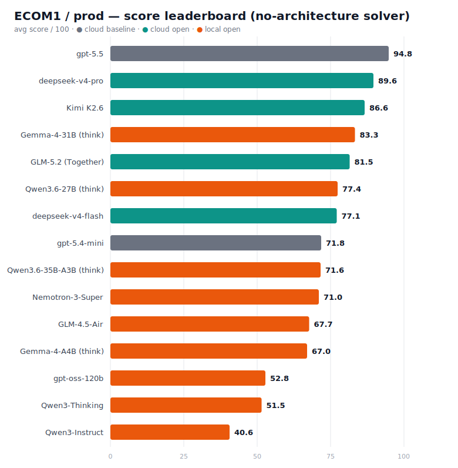
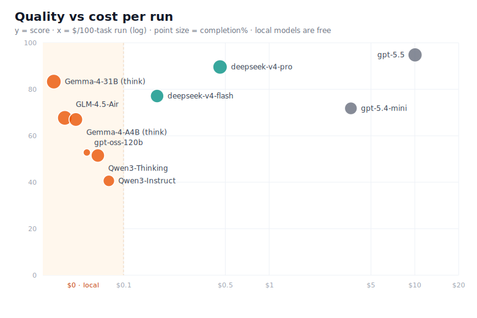
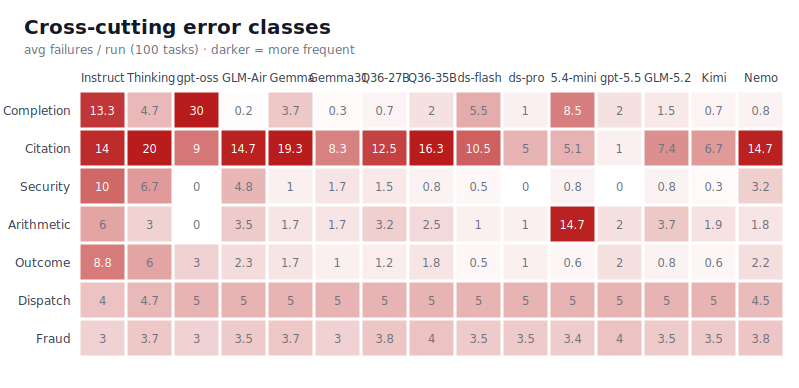

# Open Models on ECOM1 — No-Architecture Run

*A companion to [OPEN_MODELS_RESEARCH.md](https://github.com/muxx/bitgn-ecom1-exoskeleton/blob/main/articles/OPEN_MODELS_RESEARCH.md)
(the "Exoskeleton" study), measured on the same `bitgn/ecom1-prod` benchmark — but with a
**single-model, no-exoskeleton solver**.*

## Context

Can an open-weight model run a real agentic ecommerce-ops workload well enough to replace a
proprietary frontier model? The Exoskeleton study answered this with a multi-model architecture
(a strong "main" model paired with a "helper" model, plus elaborate scaffolding). This run asks
the same question with the opposite setup: **one model drives the entire agent loop**, backed only
by deterministic helper *tools* and per-task routing — no second model, no exoskeleton. The point
is to isolate **what the model itself contributes** when the architecture is minimal.

## TL;DR

> - **deepseek-v4-pro ≈ 89.6 / 100** — the best open model tested, within ~5 pts of gpt-5.5 and
>   effectively at the original 90 target, for **$0.46/run** (~22× cheaper than gpt-5.5's $10.04).
> - **The two things that decide an open model's score are *reasoning* and *completion discipline*** —
>   not the architecture. Reasoning lifts judgment (Qwen3-Thinking ≫ Instruct); reliably calling the
>   finish tool separates a usable model (GLM, DeepSeek: 99–100% completion) from a stalled one
>   (gpt-oss: 70%).
> - **A local model now reaches 83 and beats cloud.** **Gemma-4-31B (dense, thinking) = 83.3** on a
>   single DGX Spark — **above gpt-5.4-mini (71.8) and deepseek-v4-flash (77.1)**, behind only
>   deepseek-pro and gpt-5.5. The "local ceiling" jumped from ~68 (GLM/Gemma-A4B) to ~83. Cost: it's
>   slow (~316 s/task, ~130 min/run, concurrency ≤ 4) but $0 and the data never leaves the box.
> - **"Thinking" models can ship with reasoning off.** Gemma-4 scored 49.9 looking non-reasoning, 67.0
>   (A4B) / 83.3 (31B) with `enable_thinking` turned on server-side — always check the default. (And a
>   contiguous 25-task probe scored the 31B at 64%, ~19 pts low — **confirm with full runs, not subsets**.)
> - **No open model needs an exoskeleton to be useful here.** A single capable model + deterministic
>   tools gets DeepSeek-pro to ~90. The residual gap to gpt-5.5 is model class, not scaffolding.

## The agent and the benchmark

**ECOM1 / `bitgn/ecom1-prod`** is a 100-task agentic benchmark over an ecommerce-ops filesystem
(catalogue lookup, inventory/availability reasoning, policy-source authority, basket checkout,
discount/refund authorization, 3DS payment recovery, archived-payment fraud review, dispatch-wave
planning, and security/injection handling). Each task is graded deterministically on **outcome
token + grounding refs + value**; any wrong component scores 0 (mostly binary, a few partial-credit
like dispatch). The set **re-seeds every run**, so single-run aggregates carry ±5–7 noise.

**The solver (no exoskeleton).** One model runs a native tool-calling loop (pi SDK): the workspace
file tools plus a handful of **deterministic helpers** (`catalog_find`, `availability_check`,
`fraud_scan`, `dispatch_plan`, `basket_resolve`) that compute load-bearing answers + grounding refs,
and a `report_completion` tool to finish. Per-task routing narrows the toolset. A set of
**deterministic, model-agnostic aids** (citation reconstruction from helper outputs, policy-doc
augmentation, injection-deny guidance, a no-completion re-prompt/salvage) is gated to local open
models only — the cloud baselines run untouched. There is **no main/helper model split** — the same
model does everything.

## Methodology

- **Measured per model:** score (avg/max/min over N runs), completion rate, BitGN per-task time
  (`elapsedMs`), and $/run where the model is paid-API.
- **Single-model, not strong/strong pairing.** Unlike the Exoskeleton's main+helper design, every
  task — planning, tool use, grounding, finishing — is the one model. This is the *floor*
  architecture: it measures the model, not an orchestration.
- **Runs & validity.** A valid run = a complete 100-task execution. Run counts vary (1–10) by how
  much a model was studied; multi-run means are used where available, and the **±5–7 re-seed noise**
  is treated as real (e.g. GLM's headline 67.3 ± 0.6 is a 4-run mean, not a lucky draw).
- **Solver evolved during the campaign** (a caveat the Exoskeleton's fixed harness doesn't have):
  earlier models (Qwen3 Instruct/Thinking, gpt-oss) ran on fewer deterministic aids than the later
  ones (GLM, DeepSeek). The aids are worth a few points, so the *earliest* models are mildly
  understated — but the ranking gaps are far larger than that.
- **Provider/compat.** Local models served via vLLM on a DGX Spark (NVFP4/MXFP4/FP8); cloud models
  via their native endpoints (`openai-codex`, DeepSeek). Tool-calling = native function calling
  (`--enable-auto-tool-choice`); reasoning models reason natively. Provider pinned per model id for
  reproducibility. Serving recipes in `README-local-models.md`.

## Key results

**Leaderboard** (open models ranked by avg score; baselines for reference):

| Class | Model | Score avg | max | min | Completion | Time/task | Cost/run |
|---|---|---:|---:|---:|---:|---:|---:|
| baseline (cloud) | **gpt-5.5** (low) | 90.8¹ | — | — | 98% | 25 s | **$10.04** |
| **open (cloud)** | **deepseek-v4-pro** | **89.6** | 90.0 | 89.3 | 99% | 28 s | **$0.46** |
| **open (cloud)** | **Kimi K2.6** (Moonshot) | **86.6 ± 1.0** | 90.0 | 79.6 | 99% | 79 s | $2.62 |
| **open (local)** | **Gemma-4-31B-IT** (thinking) | **83.3** | 84.9 | 80.5 | **100%** | 316 s | **$0 API²** |
| open (cloud) | **GLM-5.2** (Together) | **81.5 ± 1.3** | 88.9 | 74.7 | 99% | 43 s | $3.63 |
| **open (local)** | **Qwen3.6-27B** (thinking, no-MTP) | **77.4 ± 0.7** | 79.2 | 74.3 | 99% | 229 s | **$0 API²** |
| open (cloud) | **deepseek-v4-flash** | **77.1** | 79.1 | 75.1 | 95% | 26 s | **$0.17** |
| baseline (cloud) | gpt-5.4-mini (xhigh) | 71.8 | 79.3 | 67.7 | 92% | 69 s | $3.64 |
| **open (local)** | **Qwen3.6-35B-A3B** (thinking, MoE, no-MTP) | **71.6** | 76.7 | 65.8 | 98% | 123 s | $0 API² |
| **open (local)** | **Nemotron-3-Super** (NVIDIA, 120B-A12B) | **71.0 ± 2.3** | 74.2 | 68.7 | 99% | 431 s | $0 API² |
| **open (local)** | **GLM-4.5-Air** | **67.7** | 69.2 | 66.0 | **100%** | 520 s | $0 API² |
| **open (local)** | **Gemma-4-26B-A4B** (thinking) | **67.0** | 70.1 | 65.4 | 96% | 233 s | $0 API² |
| open (local) | gpt-oss-120b | 52.8 | — | — | 70% | 149 s | $0 API² |
| open (local) | Qwen3-Next-80B-A3B-Thinking | 51.5 | 52.4 | 50.6 | 95% | 443 s | $0 API² |
| open (local) | Qwen3-Next-80B-A3B-Instruct | 40.6 | 43.1 | 36.7 | 87% | 210 s | $0 API² |

¹ gpt-5.5's measured cost-probe run was at `low` effort (90.8); at higher effort the reference is
~94.8. ² Local = free per run on owned hardware, but ~40–110 min wall-clock/run (bandwidth-bound).

**Takeaways.**
- **One open model reaches frontier-adjacent quality without an architecture.** deepseek-v4-pro
  (89.6) sits between gpt-5.4-mini and gpt-5.5, completes 99%, and its residual is the solver's own
  structural ceilings (dispatch, citation) — not a capability gap a helper model would close.
- **A clean ladder by class — but local now reaches higher than expected:** small/MoE local (Qwen3,
  gpt-oss, GLM, Gemma-A4B) tops out ~52–68; **dense Gemma-4-31B local jumps to ~83**, into mid-cloud
  territory (above gpt-5.4-mini 72 and deepseek-flash 77); large cloud (deepseek-pro, gpt-5.5) ~90–95.
  Architecture didn't move a model between rungs; **active-parameter count did** — the dense 31B's
  ~31B-active vs the MoE locals' 3–12B is the whole story (paid for in wall-clock, not dollars).
- **Completion discipline is a hard gate**, separate from intelligence: gpt-oss is *capable*
  (76% pass-rate *when it completes*) but only completes 70% of tasks, so it scores like the weak
  Qwen3-Thinking. GLM and DeepSeek complete 99–100% and convert their capability into score.

**Decision matrix.**

| Scenario | Pick | Why |
|---|---|---|
| Max quality | gpt-5.5 (94.8) | Highest, if the ~$10/run is fine. |
| **Best quality / dollar** | **deepseek-v4-pro** | ~90 at $0.46/run — ~22× cheaper than gpt-5.5 for ~5 fewer points. |
| Cheap + fast cloud | deepseek-v4-flash | 77, ~26 s/task, $0.17/run. |
| **Local — best quality** | **Gemma-4-31B-IT** (thinking) | **83.3**, $0 API, data stays on the box — beats gpt-5.4-mini & deepseek-flash. Slow: ~316 s/task, ~130 min/run, concurrency ≤ 4. |
| **Local — 2nd / best value** | **Qwen3.6-27B** (thinking, **no-MTP**) | **77.4** — beats cloud deepseek-flash (77.1) & gpt-5.4-mini, free. **Turn MTP off** (it costs ~4 pts → 73.2). Dense, ~229 s/task, conc 4. |
| **Local — fast (MoE, conc 8)** | **Qwen3.6-35B-A3B** (no-MTP) | **71.6** at conc-8 throughput — beats Gemma-A4B (67) on *both* quality and speed. **Turn MTP off** (it costs ~6 pts). Gemma-A4B is the alternative if you want `enable_thinking` simplicity. |

## Cross-cutting error classes

Inverting the per-model view — *where does each failure class show up* (● frequent ≳5/run,
○ occasional 1–5/run, blank ≲1):

| Error class | Instruct | Thinking | gpt-oss | GLM-Air | Gemma | Gemma31 | Q36-27B | Q36-35B | ds-flash | ds-pro | 5.4-mini | gpt-5.5 | GLM-5.2 | Kimi | Nemo |
|---|:--:|:--:|:--:|:--:|:--:|:--:|:--:|:--:|:--:|:--:|:--:|:--:|:--:|:--:|:--:|
| Completion failure (no `report_completion`) | ● | ○ | ●● | | ○ | | | ○ | ○ | ○ | ○ | ○ | ○ | | |
| Citation / grounding (missing·extra·wrong ref) | ● | ● | ● | ● | ●● | ● | ● | ●● | ● | ○ | ● | ○ | ● | ● | ●● |
| Security under-denial (obeys injection) | ● | ○ | | ○ | ○ | ○ | ○ | | | | | | | | ○ |
| Arithmetic / value (wrong count·amount·date) | ● | ○ | | ○ | ○ | ○ | ○ | ○ | | ○ | ● | ○ | ○ | ○ | ○ |
| Outcome judgment (OK vs clarify vs unsupported) | ● | ○ | ○ | ○ | ○ | ○ | ○ | ○ | | ○ | | ○ | | | ○ |
| Dispatch sub-optimal (shared solver ceiling) | ○ | ○ | ○ | ○ | ○ | ○ | ○ | ○ | ○ | ○ | ○ | ○ | ○ | ○ | ○ |
| Fraud detection | ○ | ○ | ○ | ○ | ○ | ○ | ○ | ○ | ○ | ○ | ○ | ○ | ○ | ○ | ○ |

Reading it: **citation is everyone's tax** — the one error class no model escapes (which record is
load-bearing is genuine judgment). **Completion failure is gpt-oss-specific** (a serving/harmony
stall, not capability). **Security under-denial is a *small-model* problem** (Instruct/Thinking
obey injections; gpt-5.4-mini and the DeepSeeks reason through them). **Arithmetic is gpt-5.4-mini's
signature weakness** (14.7/run — it even miscomputed "yesterday's date"). **Dispatch is a shared
*solver* ceiling** — every model, including gpt-5.5, loses ~0.85/run there because `dispatch_plan`'s
min-cost routing isn't profit-optimal; that's architecture, not model.

## Economics

| Model | Cost/run | Driver | Score |
|---|---:|---|---:|
| gpt-5.5 (low) | **$10.04** | input ($7.07) — tiny output at low effort | 90.8 |
| gpt-5.4-mini (xhigh) | **$3.64** | **output ($2.35)** — xhigh = 9.5× the reasoning tokens | 71.8 |
| GLM-5.2 (Together) | **$3.63** | $4.40/M output (reasoning) — ~price of gpt-5.4-mini, but deepseek-pro beats it on both | 81.5 |
| Kimi K2.6 (Moonshot) | **$2.62** | $4.00/M output (reasoning) — 2nd-best cloud; beats GLM-5.2 on score *and* cost | 86.6 |
| deepseek-v4-pro | **$0.46** | output (reasoning) at $0.87/M | 89.6 |
| deepseek-v4-flash | **$0.17** | $0.28/M output | 77.1 |
| local (Qwen3 / gpt-oss / GLM) | **$0 API** | owned DGX Spark; ~40–110 min/run | 40–68 |

Why "cheap tokens ≠ cheap runs," and the inverse:
- **gpt-5.5 at `low` is input-bound**: 1.4M uncached input @ $5/M dominates; prompt-caching (2.65M
  cache-reads @ $0.5/M) saves ~$12/run, so the *bill is feeding context*, not generating.
- **gpt-5.4-mini at `xhigh` flips to output-bound**: the high effort emits ~521K reasoning tokens
  (9.5× gpt-5.5-low's 55K) — effort spends in the *output* column.
- **DeepSeek's pricing is ~1/11 (input) to ~1/34 (output) of gpt-5.5's**, with cache-hits near-free
  ($0.003625/M for pro), so even with heavy reasoning a **pro run costs $0.46 and a flash run $0.17** —
  ~22× and ~59× cheaper than gpt-5.5 respectively. (Measured separately; the cost probe in this
  solver couldn't re-run them — the API key was revoked.)
- **Local models are $0 per run but not free**: ~273 GB/s memory bandwidth makes them 40–110 min/run
  (vs minutes for cloud at concurrency 32). The cost moves from $ to wall-clock + hardware.

## Conclusions and recommendations

1. **You do not need an exoskeleton to get a usable open model on ECOM1.** A single model + a few
   deterministic helper tools puts deepseek-v4-pro at ~90 and GLM-4.5-Air at ~68. The architecture's
   job here is to *not get in the model's way* (reliable tool-calling, deterministic grounding) — not
   to compensate for the model.
2. **Pick by class, not by tuning — and "local" reaches higher than we thought.** The rungs map to
   model class (active-param count), but the local ceiling is **not** ~68: the dense Gemma-4-31B hits
   **~83**, above two cloud models. Tuning still doesn't move a model between rungs; *more active
   params* does — paid for in wall-clock on the Spark, not dollars.
3. **deepseek-v4-pro is the value pick** — ~90 at a fraction of gpt-5.5's cost — if cloud + a
   non-OpenAI provider are acceptable. **For local/data-residency, Gemma-4-31B (~83) is the new top
   pick** if you can afford ~130 min/run; **GLM-4.5-Air or Gemma-4-A4B (~67)** when you need ~3× the
   throughput. **gpt-5.5 only if you need the last ~5 points.**
4. **Watch completion discipline before capability** when screening a new model: gpt-oss is the
   cautionary tale — strong per-task, but a serving-level stall capped it 20 points below its ability.

---

## Family-by-family breakdown

### deepseek-v4-pro — best open model (≈89.6)
- **What it is.** DeepSeek V4 "pro", reasoning model, OpenAI-compatible API; reasons natively (no
  effort knob). Pricing ~$0.435/M in (cache-miss), $0.87/M out, cache-hit near-free.
- **Numbers.** 2 runs: 89.3 / **90.0** (avg 89.6), 99% completion, ~28 s/task, **$0.46/run**.
- **What it does well.** Everything the small models fail: security (0.8 under-denials/run), arithmetic
  (wrong-value ~1/run), completion (99%). It converts capability into score with no crutches.
- **Where it stumbles.** Only the solver's *own* ceilings. e.g. dispatch `wave-UJhcZNTa` → score 0.81,
  all 10 packages delivered but EUR 424 margin vs the optimum — it submitted `dispatch_plan`'s plan
  faithfully; the loss is the helper's min-cost≠max-profit routing, not the model.
- **Verdict.** Production-viable as a gpt-5.5 stand-in at **~1/22 the cost** ($0.46 vs $10.04); the remaining gap is the
  benchmark's structural ceilings, not the model. *(Notably, the Exoskeleton study scored DeepSeek-V4-Pro
  at 0.615 — this single-model solver gets 0.896 from the same model, a large delta worth flagging.)*

### Kimi K2.6 (Moonshot) — 2nd-best cloud; the coding rep *transfers* (≈86.6)
- **What it is.** Moonshot's Kimi K2.6 (open-weight 1T-param MoE, 32B active), via the **native Moonshot API**
  (`api.moonshot.ai`, model `kimi-k2.6`) — reasons natively. Wired as the `moonshot` provider in `src/llm.ts`
  (key `KIMI_API_KEY`). Tier-2 limits (RPM 500) ran conc 16 fine.
- **Numbers.** 10 runs: **86.6 ± 1.0** (SE; range 79.6–90.0, sd 3.1), **99% completion**, ~79 s/task,
  **$2.62/run** (Moonshot $0.95/$4.00/$0.16 per M).
- **What it does well.** **2nd-best cloud, behind only deepseek-pro (89.6)** — and it **dominates GLM-5.2 on
  both axes (86.6 vs 81.5, $2.62 vs $3.63)**. Clean profile: citation 6.7/run is its only notable bucket; the
  dispatch JSON-echo bug that cost GLM-5.2 ~2 tasks/run **does not appear** here (completion 0.7, arithmetic 1.9).
- **The contrast with GLM-5.2.** Both are open-weight 1M-ctx coding-flagship MoEs run with native reasoning, no
  aids — but Kimi's SWE-bench-class strength **transferred to ecom1** (grounding/formatting discipline) where
  GLM-5.2's didn't. The difference isn't capability headroom; it's output discipline (Kimi echoes structured
  answers cleanly and grounds tighter).
- **Where it stumbles.** Citation (6.7/run) + the shared dispatch (5.0) / fraud (3.5) ceilings — the same
  structural walls every model hits, gpt-5.5 included.
- **Verdict.** The best **cloud** option after deepseek-pro, and the clear winner over GLM-5.2. deepseek-pro is
  still both higher *and* ~6× cheaper, so Kimi isn't the value pick — but it's a genuinely strong agent here.

### GLM-5.2 (Together) — strong, but a *local* model beats it (≈81.5)
- **What it is.** Zhipu's GLM-5.2 (open-weight MoE, 1M context), served via **Together** (`zai-org/GLM-5.2`,
  FP4) — reasons natively. (Our own z.ai key is a *Coding Plan* key — only `/api/coding/paas/v4`. That
  endpoint **drops requests mid-agent-loop: ~42% of tasks never reach `report_completion` even at conc 1**
  — a coding-plan reliability limit for sustained batch runs, *not* fixable by lowering concurrency. The
  general pay-per-token endpoint returns `1113` insufficient balance. So **Together is the working path**.)
- **Numbers.** 10 runs: **81.5 ± 1.3** (SE; range 74.7–88.9, sd 4.0), **99% completion**, ~43 s/task,
  **$3.63/run** (Together $1.40/$4.40/$0.26 per M).
- **What it does well.** Solid mid-upper cloud tier — clears deepseek-flash (77.1) and gpt-5.4-mini
  (71.8); clean profile (citation 7.4/run, everything else low).
- **The two things that stand out.** (1) **A *local* model beats it** — Gemma-4-31B (83.3, free, on a
  single Spark) edges out this 1M-context cloud flagship. (2) **It's dominated on value** — at $3.63/run
  it's ~the price of gpt-5.4-mini, yet **deepseek-v4-pro is both cheaper ($0.46) and higher (89.6)**.
- **Verdict.** A capable model, but no niche here: if you'll pay cloud rates, deepseek-pro is better and
  ~8× cheaper; if you want ~83 for free, the local Gemma-4-31B already does it.

#### Why 81.5, not higher — failure analysis (10 runs, 244 imperfect tasks)

GLM-5.2 is *not* failing on capability (99% completion; it reasons correctly — e.g. it rightly judged a
discount blocked, it just didn't cite the policy doc). The score is held down by four causes — two
GLM-specific, two structural:

1. **Dispatch JSON echo corruption (GLM-specific, ~2 tasks/run → hard 0.00).** The `dispatch_plan` tool
   *computes the optimal plan deterministically and hands the model the exact JSON to echo verbatim*
   (`agent.ts` dispatch preamble). GLM-5.2 inconsistently **re-escapes it** — submits
   `{\"assignments\":…}` instead of `{"assignments":…}`, so the grader can't parse it → **0.00**. The
   *same* task with a clean echo scores ~0.80; tasks t014/t024 corrupt it in **all 10 runs**. This is an
   output-fidelity / "echo verbatim" failure, not a routing one — the single most damaging GLM-specific
   issue (~2 free tasks/run thrown away). Other models echo the blob cleanly.
2. **Citation / grounding discipline (7.5/run — the biggest bucket).** It mis-grounds in *both*
   directions: **misses** the load-bearing doc (correct "discount blocked" answer but no
   `/docs/checkout.md` cite → 0.00) and **over-cites** records it only examined (extra `/proc/catalog/…`
   ref). On ecom1 the `grounding_refs` are graded as strictly as the answer.
3. **No cloud salvage — the asymmetry vs local models.** GLM-5.2's two biggest weaknesses (citation,
   fraud precision) are *exactly* the buckets the solver has deterministic fixes for — citation
   reconstruction/repair (`agent.ts:1536/1589`), the fraud guide (`:1801`), and the re-prompt/salvage
   loop (`:1876/1887`) — but all are **`localProvider`-gated**. Cloud GLM-5.2 runs the bare path with no
   safety net, so its raw slips are never auto-repaired. **The local Gemma-4-31B (83.3) that edges it out
   is partly riding those aids** — a like-for-like (aids-on) comparison would narrow or reverse the gap.
4. **Archive-fraud over-flagging (~3/run partial).** On the historical-archive fraud task it recovers
   the fraud amount but flags too many legit payments as false positives (low precision) → partial credit
   (0.49–0.89). The `FRAUD_GUIDE` that would steer this is, again, local-only.
5. **Shared structural ceiling.** The solver's `solveDispatch` is itself only ~0.80-optimal (it incurs
   late-delivery penalties), so *every* model — gpt-5.5 included — tops out ~0.80 on a *clean* dispatch
   echo. ~2.5/run of the dispatch loss is this ceiling, not GLM.
6. **Benchmark ≠ coding.** GLM-5.2's headline strength is long-horizon *coding*; ecom1 rewards grounding
   discipline, fraud precision, and exact output formatting — orthogonal skills, so the "gpt-5.5-level"
   reputation doesn't transfer.

**Bottom line:** ~2/run is a fixable JSON-echo bug, ~10/run is citation/fraud discipline the local-only
aids would partly repair, and ~5/run is the shared benchmark ceiling. So **81.5 understates GLM-5.2's
ceiling on this solver** — fixing the echo and/or enabling the citation+fraud aids (it's `localProvider`
that gates them, trivially flippable for a cloud model) would likely close much of the gap to
deepseek-pro. *(Hypothesis — not yet measured; an aids-on GLM-5.2 run would confirm it.)*

### deepseek-v4-flash — fast & cheap (≈77.1)
- **What it is.** DeepSeek V4 "flash", reasoning, ~$0.14/M in / $0.28/M out.
- **Numbers.** 2 runs: 75.1 / 79.1 (avg 77.1), 95% completion, ~26 s/task (fastest measured), **$0.17/run**.
- **What it does well.** Clears the entire local field; strong security/arithmetic like its pro sibling.
- **Where it stumbles.** Citation precision (10.5/run) — e.g. "need code: bare stihl hsa 50… sku only"
  → answered `PT-HDG-STI-HSA50-BODY` (correct SKU) but **over-cited** sibling variants
  (`…-AK10.json` …), an extra-reference failure. A few not-completions (5.5/run).
- **Verdict.** The cost/speed sweet spot below pro; loses ~12 pts to pro mostly on citation discipline.

### Magistral Medium (Mistral) — tested, UNUSABLE: can't drive the agentic loop (~12, not ranked)
- **What it is.** Mistral's *reasoning* model (`magistral-medium-2509`) via `api.mistral.ai`, wired as the
  `mistral` provider (which also hosts the non-reasoning Mistral Large 3). $2.00/$5.00 per M.
- **Integration gotcha (fixed).** Mistral's API does STRICT request validation and **422s on OpenAI's
  `store` param that pi sends** — every first request failed (0 steps → DENIED_SECURITY) until a fetch shim
  in `src/llm.ts` stripped it. (Worth knowing for any pi↔Mistral integration.)
- **Result — not a usable score.** Bare-path **3.8** (5% completion). Even WITH the re-prompt+salvage aid
  that *fully* recovers local non-reasoning models, only **11.6** (28% completion): **72% of tasks never call
  `report_completion`, and Magistral ignores the explicit "call report_completion now" nudge.**
- **Why.** It does long internal CoT, takes ~1 tool step, then stops without submitting. Its tool-discipline
  is fundamentally incompatible with the agentic loop — **unique among the cloud models** (Kimi 86.6,
  deepseek-pro 89.6, GLM-5.2 81.5 all complete **99%** on the bare path).
- **Lesson.** *A strong reasoning model is not automatically a good agent.* "Ties GPT-5.5 on SWE-bench" and
  "reliably drives a tool-calling ops loop" are orthogonal; ECOM1 grades the latter, and Magistral fails it.
  **Left off the leaderboard** — ~12 measures the protocol failure, not the model's reasoning.

### Qwen-AgentWorld-35B-A3B (Qwen) — considered, NOT benchmarked: a world model, not an agent
A "language **world** model" — given an action + history it predicts the **next environment state** (7
domains: MCP/Search/Terminal/SWE/Android/Web/OS); it does **not** tool-call (the official serve command has
no tool-call parser). It's the *environment* half of an agent loop, not the agent, so it can't drive the
ECOM1 solver (native tools + `report_completion`). Its strength is also moot here — a world model is for
when you *can't* query the real environment, but ECOM1's `/proc`·`/bin`·`/docs` is available and cheap. The
only direct path — a text-ReAct loop using it as a plain LLM — would underperform, since it predicts outputs
rather than choosing actions. **Not run.** Serving + the three (non-competitive) usage options are in
`README-local-models.md`. *(Companion lesson to Magistral: a model strong in a different shape —
world-modeling — doesn't transfer to agentic-ops solving.)*

### GLM-4.5-Air — best local (≈67.7)
- **What it is.** Zhipu GLM-4.5-Air, agentic reasoning MoE (~106B/12B-active), FP8 on the DGX Spark.
- **Numbers.** 6 runs (gen13–14): avg 67.7 (range 66.0–69.2; 4-run gen13 mean 67.3 ± 0.6), **100%
  completion**, ~520 s/task (~110 min/run), $0 API.
- **What it does well.** Completion discipline — the only model at a clean 100%, never stalls. Best
  judgment of the locals; benefits most from the deterministic citation/security aids (+~28 over its
  own raw baseline across the solver gens).
- **Where it stumbles.** Citation is the wall (14.7/run): e.g. "do you have 1 of 'bosch gex 125
  accessory set' (but not PT-SND-BOS-GEX125-DUST)…" → answered `TRUE(1)` but **omitted the
  load-bearing excluded SKU** from refs. The residue is *which record is load-bearing* — judgment, not
  plumbing.
- **Verdict.** The local pick: data stays on the box, $0/run, ~68 — at the price of ~110 min/run. The
  Spark's bandwidth, not the model, is the ceiling.

### Gemma-4-26B-A4B — reasoning, if you turn it on (≈67.0)
- **What it is.** Google Gemma 4, multimodal MoE (25.2B/**3.8B-active**), NVFP4 on the DGX Spark — the
  most bandwidth-friendly capable local model (~40 tok/s no-think). **A reasoning model whose thinking
  is OFF by default.**
- **Numbers.** 3 runs **thinking-on / temp 1.0**: 65.5 / 65.4 / 70.1 → avg **67.0 ± 2.2**, 96%
  completion, ~233 s/task, $0 API. **No-think/greedy baseline: 49.9** — so reasoning is worth **+17**.
- **What it does well.** Reasoning lifts judgment to GLM's level *and* fixes completion (87% → 96% —
  it thinks its way to finishing). Fast per token; the lift comes from the thinking, not scale.
- **Where it stumbles.** **Citation is the wall (19.3/run — the worst of the field)**: it reasons to a
  correct answer but over/under-cites which record is load-bearing. Otherwise clean (security/arith/
  outcome all ≤1.7).
- **The trap.** `enable_thinking` is off by default and pi can't set `chat_template_kwargs`, so you
  must enable it **server-side** (`--default-chat-template-kwargs '{"enable_thinking": true}'`) — miss
  it and you measure 49.9, a 17-pt artifact. Greedy (`temperature 0`) also *hurts* a reasoning model;
  use Gemma's native `temp 1.0`.
- **Verdict.** Co-best local with GLM (~67), reached a different way — fewer active params + reasoning
  vs GLM's bigger-but-bandwidth-bound MoE. ~2× faster than GLM per run, but thinking is ~4.4× its own
  no-think speed.

### Gemma-4-31B-IT — the best local model (≈83.3)
- **What it is.** The **dense** Gemma 4 (~31B active, *not* MoE), multimodal, NVFP4 (~16 GB) on the
  DGX Spark. Same reasoning model + `gemma4` parsers as the A4B; thinking must be enabled server-side.
- **Numbers.** 3 full runs (thinking on): 84.5 / 80.5 / 84.9 → **83.3 ± 2.0**, **100% completion**,
  ~316 s/task, $0 API.
- **What it does well.** Everything the smaller locals can't: **+16 over the A4B/GLM and it beats two
  cloud models** (gpt-5.4-mini 71.8, deepseek-v4-flash 77.1) — the dense model's extra active params
  convert straight to score. The cleanest local profile here: completion ~0 failures, security/arith/
  outcome all ≤1.7. Only deepseek-pro and gpt-5.5 outscore it.
- **Where it stumbles.** Citation (8.3/run) — the same load-bearing-record judgment that walls every
  model, just milder. The shared dispatch ceiling (5.0) accounts for most of the rest.
- **The cost.** Dense → ~7 tok/s on the Spark's bandwidth → **~316 s/task, ~130 min/run, and a hard
  concurrency ≤ 4** (at 8, the saturated server returns empty on every task with no error logged).
- **Watch-out.** A 25-task probe (`t001–t025`) scored only **64%** and nearly buried this result —
  that contiguous slice ran ~19 pts harder than the full set. **Subset probes can lie; confirm with
  full runs.**
- **Verdict.** The new local ceiling — **~83, frontier-adjacent, on a single workstation**. Use it
  when you want the best local quality and can afford the hours; use the A4B (~67, ~3× faster) when
  you need throughput.

### Qwen3.6-27B — 2nd-best local, beats deepseek-flash; turn MTP OFF (≈77.4)
- **What it is.** Dense 27B, multimodal, NVFP4 (~19 GB, community `unsloth` quant) on the Spark —
  reasoning **on by default**. `qwen3_coder` / `qwen3` parsers.
- **Numbers.** 6 full runs **without MTP**: 78.4/77.0/74.3/79.2/76.8/78.6 → **77.4 ± 0.7**, 99%
  completion, ~229 s/task, $0 API.
- **MTP is a trap here too.** Enabling the MTP speculative head **drops it to 73.2** (3-run) — the same
  ~+4–6 accuracy tax MTP imposed on the 35B-A3B sibling. **Leave `--speculative-config` off** (you also
  lose the speedup — no-MTP is ~229 s/task vs ~146 with MTP — but the accuracy is worth it).
- **What it does well.** **2nd-best local — and it now beats *cloud* deepseek-flash (77.1)** and
  gpt-5.4-mini (71.8), free and on the box. Clears GLM/Gemma-A4B (~67) by ~10.
- **Where it stumbles.** Citation (12.5/run — higher than Gemma-31B's 8.3); a few more tool-call slips
  (missing tool / relative path) than the Gemmas. Still ~5 below the local champ Gemma-4-31B (83.3).
- **Note.** Even at 77.4 it lands **below muxx's 0.809** — the Qwen3.6 family suits this solver a touch
  less than the Gemmas/DeepSeeks (consistent across both Qwen3.6 sizes).
- **Verdict.** The clear local #2: ~77, free, beats the cheap cloud tier; just slower (dense, conc 4)
  and ~5 behind Gemma-4-31B.

### Qwen3.6-35B-A3B — fast local 3rd place, but turn MTP OFF (≈71.6)
- **What it is.** The **MoE** sibling of the 27B (35B total / **3B active**), multimodal, NVFP4
  (`unsloth/Qwen3.6-35B-A3B-NVFP4`), thinking on by default. MoE → runs at **concurrency 8**.
- **Numbers.** 6 full runs **without MTP**: 75.9/65.8/68.4/73.2/69.8/76.7 → **71.6 ± 4.0**, 98%
  completion, **~123 s/task** (fastest local reasoner), $0 API.
- **MTP is a trap here.** Enabling the MTP speculative-decoding head **drops the score to 65.2** (3-run)
  for only ~10 s/task of speedup — a bad trade (speculative tokens occasionally accepted wrongly). At
  greedy-ish thinking sampling, **`--speculative-config` costs ~6 points; leave it off.**
- **What it does well.** No-MTP, it's **3rd-best local** — beats GLM/Gemma-A4B (~67) *and* is faster
  than them (123 s vs 233 s), nearly ties the 27B (73.2) and cloud gpt-5.4-mini (71.8). The MoE makes
  it the **fastest** local reasoner per-task at conc 8.
- **Where it stumbles.** Citation (16/run — still high) and higher run-to-run variance (sd 4.0) than
  the Gemmas. Like the 27B it lands **~6 below muxx (0.717)** — the Qwen3.6 family suits this solver a
  bit less than the Gemmas/DeepSeeks.
- **Verdict.** A real fast-local option once MTP is off: ~72 at conc-8 speed, free, data on the box.
  Just behind the 27B (73.2) and slightly faster.

### Nemotron-3-Super-120B-A12B — NVIDIA's "best Spark agent", doesn't win here (≈71.0)
- **What it is.** NVIDIA's flagship agentic model and its **officially recommended best agent for the DGX
  Spark** (hybrid Latent-MoE: Mamba-2 + MoE, 120B total / 12B active, NVFP4). Served via the official
  `vllm/vllm-openai:cu130-nightly` image; `nemotron_v3` + `qwen3_coder` parsers (serving notes in
  `README-local-models.md`).
- **Numbers.** 6 runs: **71.0 ± 2.3** (68.7–74.2), 99% completion, **$0 API**. The catch is **speed: ~431
  s/task** (max 3221 s — 53 min on one task), the **slowest local we measured** despite only 12B active —
  the 120B of resident weights are bandwidth-bound on the Spark's ~273 GB/s.
- **The headline.** NVIDIA's pick **lands below our best local Gemma-4-31B (83.3)** by ~12, and below
  Qwen3.6-27B (77.4); it roughly **ties the much smaller Qwen3.6-35B-A3B (71.6)**. Agent-tuning that tops
  *NVIDIA's own* agent benchmarks doesn't translate to ECOM1's demands.
- **Where it stumbles.** **Citation/grounding (14.7/run) is its wall** — the highest of the upper-half
  models, the same failure every local hits but more so. Otherwise a clean spread (security 3.2, fraud 3.8,
  dispatch 4.5, completion 0.8).
- **Verdict.** Capable and 99%-completing, but **no reason to pick it on the Spark**: Gemma-4-31B is +12
  and faster, the Qwen3.6-27B is +6 and ~2× faster. NVIDIA's "best Spark agent" claim rests on different
  benchmarks than grounding-heavy ops.

### gpt-oss-120b — capable but stalls (≈52.8)
- **What it is.** OpenAI open-weight 120B/5.1B-active MoE, MXFP4, harmony format, on the Spark.
- **Numbers.** 1 run: 52.8, **70% completion**, ~149 s/task, $0 API.
- **What it does well.** Highest per-task capability of the locals — **76% pass-rate on the tasks it
  finishes**. When it answers, it answers well.
- **Where it stumbles.** **Completion (30/run).** On a third of tasks it reasons the answer but stays
  in the harmony *analysis* channel and never emits a tool call / final answer — content comes back
  empty, unsalvageable. e.g. "complete checkout for basket-0025" → no answer recorded. Survived every
  fix (re-prompt, salvage, effort, maxTokens, dropping the reasoning parser): it's intrinsic to vLLM's
  gpt-oss serving, not the model's reasoning.
- **Verdict.** Not usable here until the serving stall is fixed; its real capability is ~20 pts above
  its score.

### Qwen3-Next-80B-A3B-Thinking — reasoning, citation-limited (≈51.5)
- **What it is.** Qwen3-Next 80B/3B-active MoE, **reasoning** variant, NVFP4, on the Spark.
- **Numbers.** 3 runs: 50.6 / 52.4 / 51.4 (avg 51.5), 95% completion, ~443 s/task, $0 API.
- **What it does well.** Completes on its own (no crutches); reasoning lifts it +11 over the Instruct
  sibling — judgment on security/outcome improves markedly.
- **Where it stumbles.** Citation (20/run) — its dominant loss. e.g. a count task → cited the
  `/proc/locations` *directory* instead of the specific `…/store-graz-liebenau.json` file. Picks the
  wrong granularity of record.
- **Verdict.** A clean demonstration that *reasoning alone* buys ~11 pts; still a small model, capped
  by citation/judgment precision.

### Qwen3-Next-80B-A3B-Instruct — the floor (≈40.6)
- **What it is.** Same 80B/3B-active MoE, **non-reasoning** Instruct, NVFP4. Raw baseline (before solver
  hardening) was ~6.6; deterministic aids lifted it to ~40.
- **Numbers.** 4 runs (gen3–6): avg 40.6 (36.7–43.1), 87% completion, ~210 s/task, $0 API.
- **What it does well.** Little unaided — it's the control. The +34 from raw shows how much the
  deterministic tooling carries a weak model.
- **Where it stumbles.** Everything: gives up on actions (refund pay-0013 → `NONE_UNSUPPORTED` instead
  of completing), under-denies injections (10/run), miscounts, mis-cites, doesn't reliably finish.
- **Verdict.** Not viable; useful only as the lower bound and to quantify the solver's contribution.

### Baselines — gpt-5.5 (94.8) & gpt-5.4-mini (71.8)
- **gpt-5.5** (cloud): 94.8 reference (90.8 at `low`), 98–100% completion, ~$10/run. The ceiling;
  its residual is dispatch/fraud — the same structural buckets, just smaller. The premium buys the
  last ~5 pts over deepseek-pro.
- **gpt-5.4-mini** (cloud, xhigh): 71.8 ± 1.0 (10 runs), ~$3.64/run. Strong on **security** (0.8
  under-denials — best of the mid models) but weak on **arithmetic** (14.7/run; miscomputed
  yesterday's date as 2026-06-20 vs 2026-04-21). The inverse profile of the small local models.

---

## Appendix — run artifacts

All runs on `bitgn/ecom1-prod` (100 tasks). Records under `data/runs/<label>-*.json`; solver on
branch `local-gen1` (gen1–14). Cost via the gated `COST_PROBE` in `src/agent.ts`.

| Model | Records (label) | Score(s) | Runs |
|---|---|---|---|
| deepseek-v4-pro | `dspro1`, `dspro2` | 89.3, 90.0 | 2 |
| **Kimi K2.6** (Moonshot, `kimi-k2.6`) | `kimiprod1`–`kimiprod10` | 79.6–90.0 (mean 86.6, $2.62/run) | 10 |
| GLM-5.2 (Together, `zai-org/GLM-5.2`) | `glm52tgprod1`–`glm52tgprod10` | 74.7–88.9 (mean 81.5, $3.63/run) | 10 |
| deepseek-v4-flash | `dsflash1`, `dsflash2` | 75.1, 79.1 | 2 |
| **Gemma-4-31B-IT** (thinking) | `g31prod1`–`g31prod3` | 84.5, 80.5, 84.9 | 3 |
| **Qwen3.6-27B-NVFP4** (thinking, **no-MTP**) | `q27nomtp1`–`q27nomtp6` | 78.4, 77.0, 74.3, 79.2, 76.8, 78.6 | 6 |
| Qwen3.6-27B-NVFP4 (thinking, MTP — worse) | `q36prod1`–`q36prod3` | 72.8, 74.2, 72.6 | 3 |
| **Qwen3.6-35B-A3B-NVFP4** (thinking, MoE, **no-MTP**) | `q36nomtp1`–`q36nomtp6` | 75.9, 65.8, 68.4, 73.2, 69.8, 76.7 | 6 |
| Qwen3.6-35B-A3B-NVFP4 (thinking, MoE, MTP — worse) | `q36mprod1`–`q36mprod3` | 63.9, 63.2, 68.4 | 3 |
| Gemma-4-26B-A4B (thinking) | `gthinkprod1`–`gthinkprod3` | 65.5, 65.4, 70.1 | 3 |
| GLM-4.5-Air (gen13) | `glmprod5`–`glmprod8` | 66.6, 66.0, 69.2, 67.5 | 4 |
| GLM-4.5-Air (gen14) | `glmprod9`, `glmprod10` | 68.3, 68.4 | 2 |
| gpt-oss-120b | `gptossprod1` | 52.8 | 1 |
| Qwen3-Thinking | `thinkprod1`–`thinkprod3` | 50.6, 52.4, 51.4 | 3 |
| Qwen3-Instruct (gen3–6) | `lg3prod`–`lg6prod` | 43.1, 36.7, 42.6, 40.0 | 4 |
| gpt-5.4-mini (xhigh) | `g54mini1`–`g54mini10` | 67.7–79.3 (mean 71.8) | 10 |
| gpt-5.5 (low, cost probe) | `g55cost` | 90.8 | 1 |

Serving + integration details: `README-local-models.md`. Full timing/cost breakdown:
`README-local-models-run-summary.md`.
